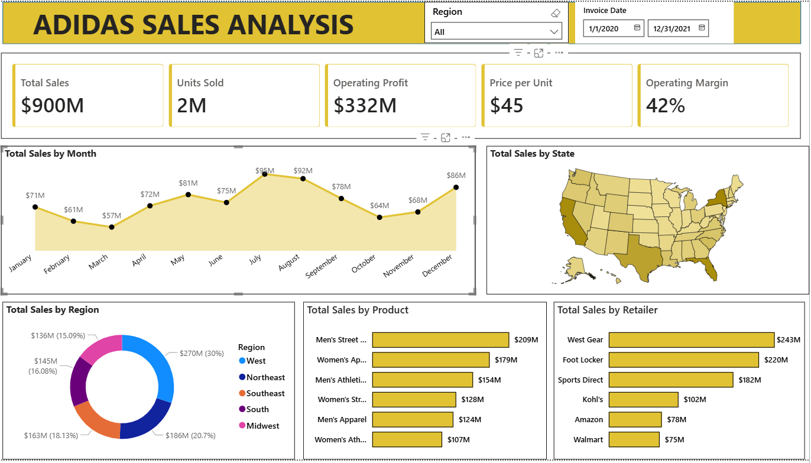

# Adidas Sales Analysis — Power BI Dashboard

## Project Overview
This project is an end-to-end sales performance analysis for Adidas US retail data covering the years 2020 and 2021. Built entirely in Microsoft Power BI, the dashboard provides interactive insights into revenue trends, product performance, regional distribution, and retailer contributions.

---

## Objectives
- Track overall sales performance and profitability across two years
- Identify the top-performing products by revenue
- Analyze sales distribution across US regions and states
- Compare retailer performance to highlight key sales partners
- Enable dynamic filtering by region and date range

---

## Tools Used
- **Microsoft Power BI** — data modeling, DAX measures, and dashboard design
- **Power Query** — data cleaning and transformation
- **Microsoft Excel** — source data format

---

## Dataset
The dataset contains Adidas US retail sales records including:
- Invoice date, region, and state
- Retailer name and sales method
- Product category, units sold, price per unit
- Total sales, operating profit, and operating margin

**Period covered:** January 2020 – December 2021

---

## Dashboard Highlights

| KPI | Value |
|---|---|
| Total Sales | $900M |
| Units Sold | 2M |
| Operating Profit | $332M |
| Price per Unit | $45 |
| Operating Margin | 42% |

### Visuals included:
- **Total Sales by Month** — trend line showing seasonal peaks (July–August highest)
- **Total Sales by State** — US map with state-level sales intensity
- **Total Sales by Region** — donut chart (West leads at 30%)
- **Total Sales by Product** — Men's Street Footwear tops at $209M
- **Total Sales by Retailer** — West Gear leads at $243M

---

## Key Insights
- Sales peaked mid-year (July at $95M), suggesting strong summer demand
- The **West region** contributed the highest share of total sales at 30%
- **Men's Street Footwear** was the best-performing product category
- **West Gear** and **Foot Locker** were the top two retail partners by revenue
- Operating margin held steady at 42%, indicating consistent profitability

---

## Screenshot

---

## How to View
1. Download the `.pbix` file from this repository
2. Open it with [Microsoft Power BI Desktop](https://powerbi.microsoft.com/desktop/) (free)
3. Use the **Region** slicer and **Invoice Date** filter to explore the data interactively

---

## Notes
This project was built as part of my data analytics portfolio following a structured tutorial. The analysis logic and dashboard structure follow the original project design; the colour scheme was customized.
